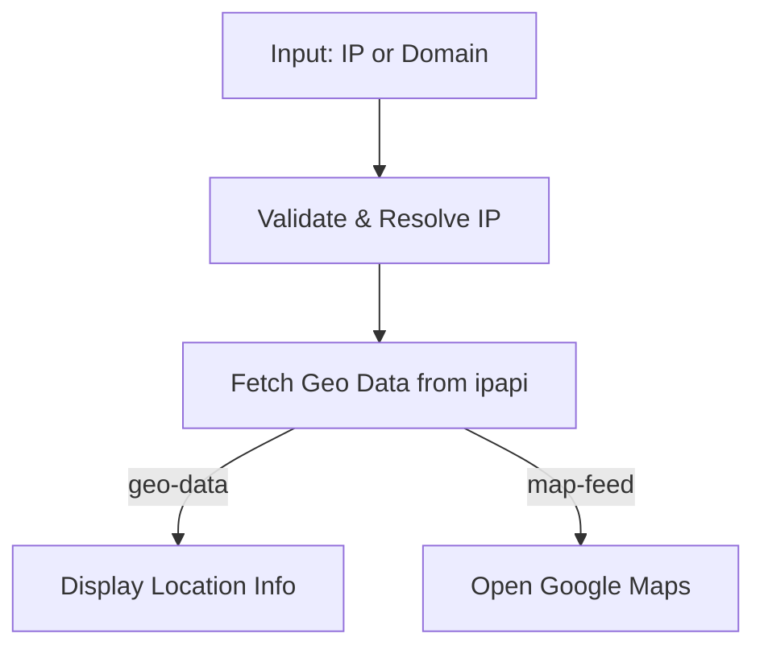

# 🌍 IP_Track

A simple Python utility to retrieve **geolocation data** for an IP address or domain name, and optionally open the location on **Google Maps**.

---

##  Features
- Lookup geolocation data (city, country, coordinates, etc.) for an IP address or domain.
- Open the resolved location directly in Google Maps.
- Works with both IPv4 addresses and domain names.

---

##  Requirements
- Python 3.7+
- Dependencies:
  - [ipapi](https://pypi.org/project/ipapi/)
  - Standard libraries (`socket`, `ipaddress`, `webbrowser`, `time`, `sys`, `pprint`)

Install dependencies with:

```bash
pip install ipapi
```

#  Usage
Run the script from the terminal:

```bash
python locator.py [command] [IP | domain-name]
```
## Commands:
 - geo-data → Prints geolocation data of the target.

 - map-feed → Opens Google Maps with the target's coordinates.

##  Examples
1. Get geolocation data for an IP:
```bash
python locator.py geo-data 8.8.8.8
```
Example output:

```json
{
  "ip": "8.8.8.8",
  "city": "Mountain View",
  "region": "California",
  "country": "US",
  "latitude": 37.386,
  "longitude": -122.0838,
  ...
}
```
2. Open location of a domain in Google Maps:
```bash
python locator.py map-feed openai.com
```
➡ This will launch your default browser with the coordinates.

##  Workflow


Y.

---

